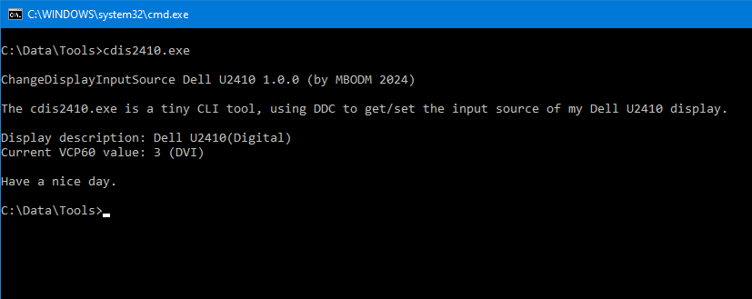

# cdis2410
A tiny Windows command-line tool using DDC to change the input source of my Dell U2410 display

### cdis2410
- is a tiny .NET 8 console application written in C#
- uses DDC to get/set the input source of my Dell U2410 display
- achieves this by using the Windows API
- has no dependencies to anything (no 3rd party library etc.)
- is developed and built with Visual Studio 2022 17.8.5 (Community Edition)
- is built and published as self-contained win-x64 AOT assembly
- has an executable size of 2MB

#### Have fun.
